# Hotel Management System

## Overview

Hotel Management System is a desktop-based application developed using Java Swing and MySQL. The application helps manage hotel operations such as customer registration, room booking, employee management, room status tracking, and customer records through a user-friendly graphical interface.

The system was designed to simplify hotel administration by providing centralized management of customers, employees, rooms, and check-in/check-out operations.

---

## Features

* Customer Registration
* Room Booking and Allocation
* Room Management
* Employee Management
* Customer Details Management
* Current and Past Customer Records
* Check-In and Check-Out Management
* Hotel Dashboard
* MySQL Database Integration
* User-Friendly Java Swing Interface

---

## Technologies Used

### Frontend

* Java Swing
* JFrame

### Backend

* MySQL

### Development Tools

* Eclipse IDE
* MySQL Workbench

---

## Project Structure

```text
Hotel_Management
│
├── src
│   ├── Management
│   └── Images
│
├── README.md
└── .gitignore
```

---

## Screenshots

### Reception Dashboard

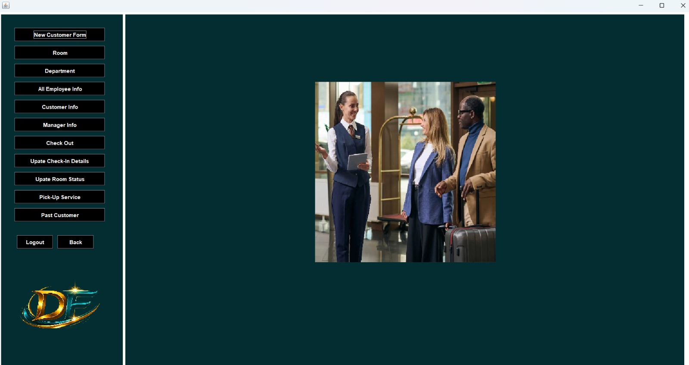

### Admin Panel

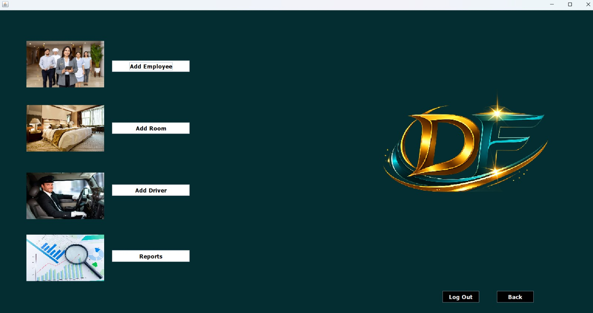

### Main Dashboard

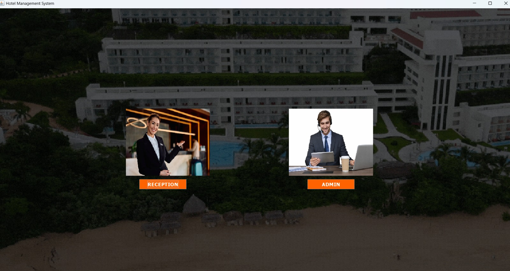

### New Customer Registration

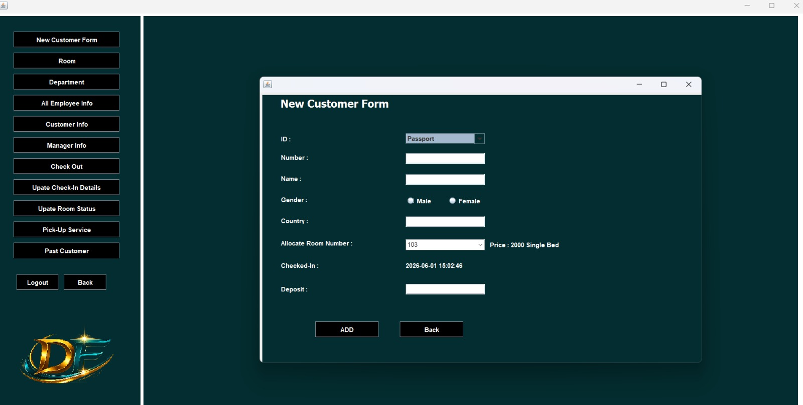

### Current Customers

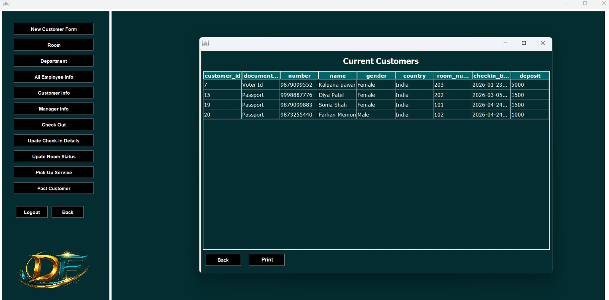

### Past Customers

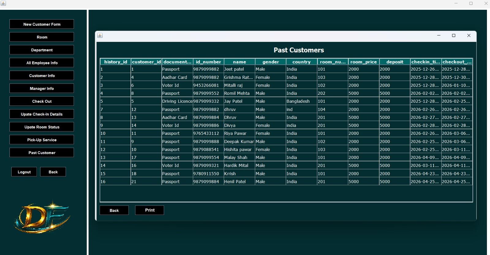

### Current Employees

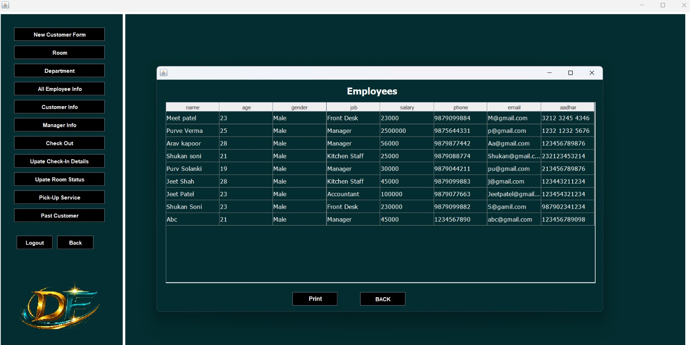

### Add New Employee

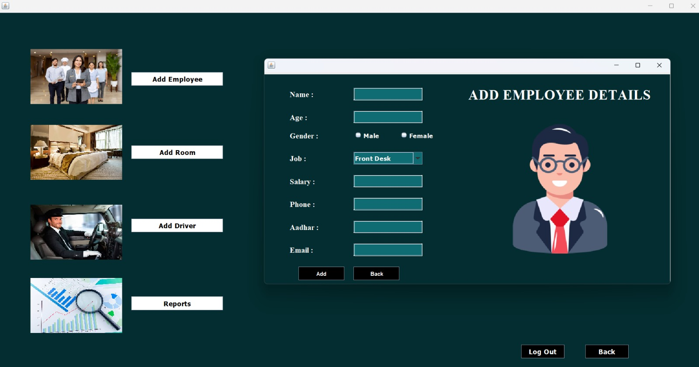

### Current Room Status

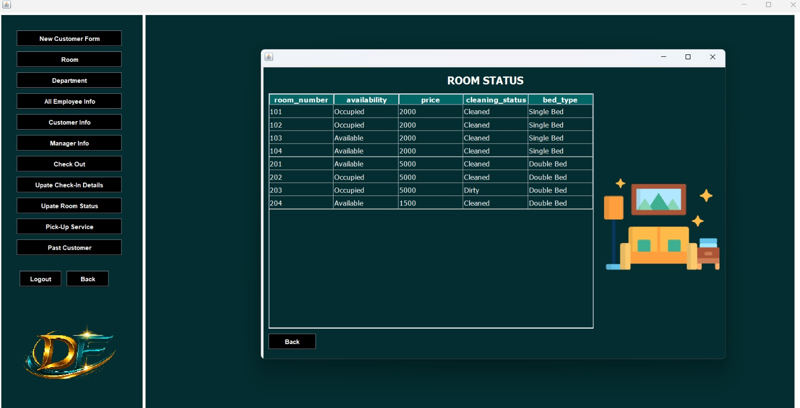

### Update Room Status

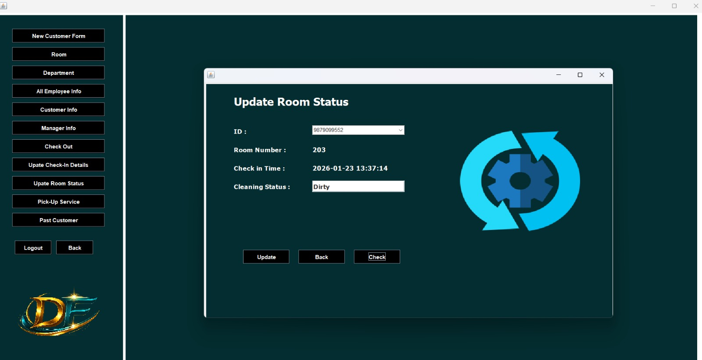

### Update Check-In Details

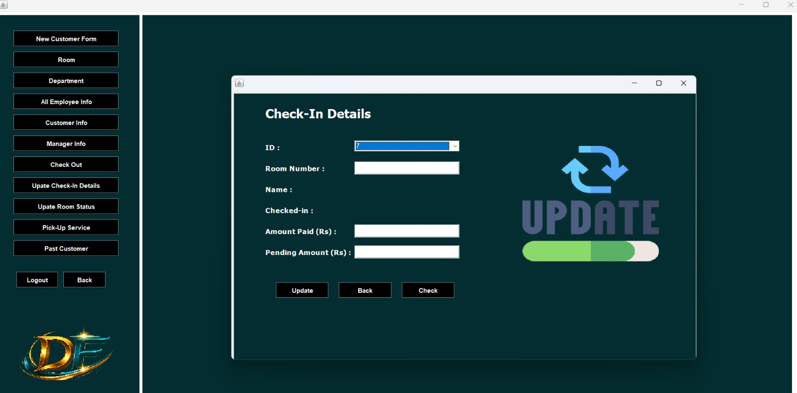

---

## Installation

### 1. Clone the Repository

```bash
git clone https://github.com/Dhruv05-hue/Hotel-Management-System-Java.git
```

### 2. Open the Project

Open the project in Eclipse IDE.

### 3. Configure MySQL

Create the required database and tables in MySQL Workbench.

### 4. Update Database Credentials

Update the database username and password in the source code according to your local MySQL configuration.

### 5. Run the Application

Run the application from Eclipse IDE.

---

## Author

**Dhruv Pawar**

* GitHub: https://github.com/Dhruv05-hue

---

## License

This project is intended for educational and portfolio purposes.
